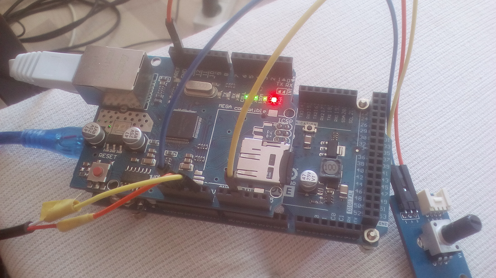
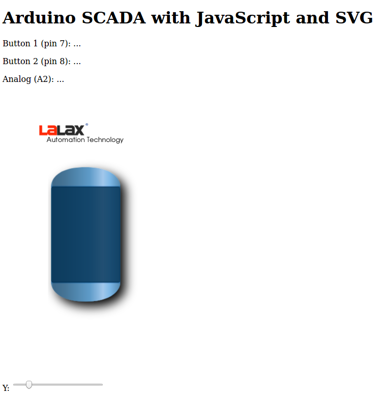

# Arduino SCADA with JavaScript and SVG
Arduino Due +   ethernet Shield Module W5100 implement a web server embedded, serving SCADA front end for monitoring and interact with the system.It use JavaScript and SVG, It include read and write digital and analog devices. 

<html>
<head></head>
<body>
The Hardware 
 Arduino DUE + ethernet shield
 
The web 
 
Tank controled by potentiometer pluged analog 2 
The web is stored in the SD card
</body>  
</tml>
